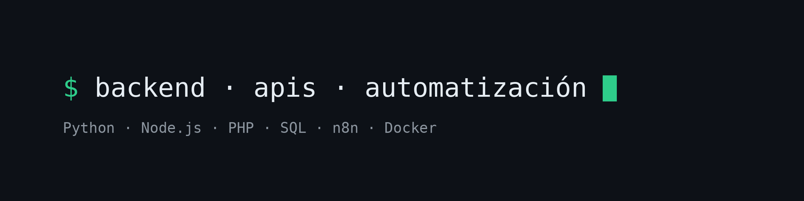

~~~bash
$ whoami
> Miquel Moreno — Automatización de procesos · IA aplicada · Full-stack
~~~

**ES** · Automatizo procesos de empresa con n8n, Python e integraciones por API, y llevo cada proyecto desde el análisis hasta el servidor en producción. Antes, tres años administrando la infraestructura de una empresa industrial.

**EN** · I automate business processes with n8n, Python and API integrations, taking each project from analysis to a production server. Before that, three years running the infrastructure of an industrial company.

### <code>$ ls ./proyectos</code>

| Proyecto | Qué hace | Tecnología |
|---|---|---|
| **[ZER0](https://github.com/miquel-moreno/zer0-coaching-platform)** | Plataforma de coaching de fitness y nutrición en producción | TypeScript · Next.js · PostgreSQL |
| **[Amazon Profitability Hub](https://github.com/miquel-moreno/amazon-profitability-hub)** | Beneficio real por producto cruzando las APIs de Amazon | Python · APIs REST · SQL |
| **[TMI n8n Automations](https://github.com/miquel-moreno/tmi-n8n-automations)** | Pedidos del correo al taller sin registro manual | n8n · Google Drive · Telegram |
| **[TMI Pricing & Invoicing](https://github.com/miquel-moreno/tmi-pricing-invoicing)** | Presupuestos y facturas en PDF para un taller de chapa | Python · Flask · SQLite |
| **[TMI Order Management](https://github.com/miquel-moreno/tmi-order-management)** | Panel de pedidos del taller en producción: ficha y etiqueta automáticas desde el correo · [demo en vivo](https://demo-taller.tmisystem.com) | Node.js · Express · SQLite |
| **[TMI Website](https://github.com/miquel-moreno/tmi-website)** | Web corporativa · [tmisystem.com](https://tmisystem.com) | HTML · CSS · JavaScript |

### <code>$ cat ./experiencia.log</code>

~~~text
2025 → hoy    Responsable de Automatización de Procesos · Tenkai Global
              n8n (email → PDF → Google Drive → Telegram) · Python/Flask · Docker

2024 → hoy    Responsable Técnico y de Datos · Ionea Global
              Rentabilidad por producto vía API de Amazon · SQL · previsión de stock

2024 → 2025   Desarrollador Full Stack · NavionTruck
              PHP · Laravel · bases de datos

2020 → 2023   Administrador de Sistemas · Bermad Europe
              Windows Server · VMware · Microsoft Azure · Oracle
~~~

### <code>$ cat ./stack</code>

| | |
|---|---|
| **Automatización** | n8n · Python · APIs REST · Webhooks · OAuth 2.0 · Integración de LLMs |
| **Desarrollo** | Flask · JavaScript · TypeScript · Next.js · Node.js · PHP · Laravel · Git |
| **Datos** | SQL · PostgreSQL · SQLite · Oracle |
| **Infraestructura** | Docker · Linux · Microsoft Azure · VMware · Windows Server |

**Formación** · Grado Superior en Administración de Sistemas Informáticos en Red (ASIR), perfil en ciberseguridad · 2022–2024

### <code>$ ./contacto</code>

[LinkedIn](https://www.linkedin.com/in/miquel-moreno-martinez) · [miquel.moreno.martinez@gmail.com](mailto:miquel.moreno.martinez@gmail.com) · Pallejà, Barcelona

~~~bash
$ echo $STATUS
> Disponible para incorporarme · remoto o híbrido desde Barcelona
> Available to join · remote or hybrid from Barcelona
~~~
